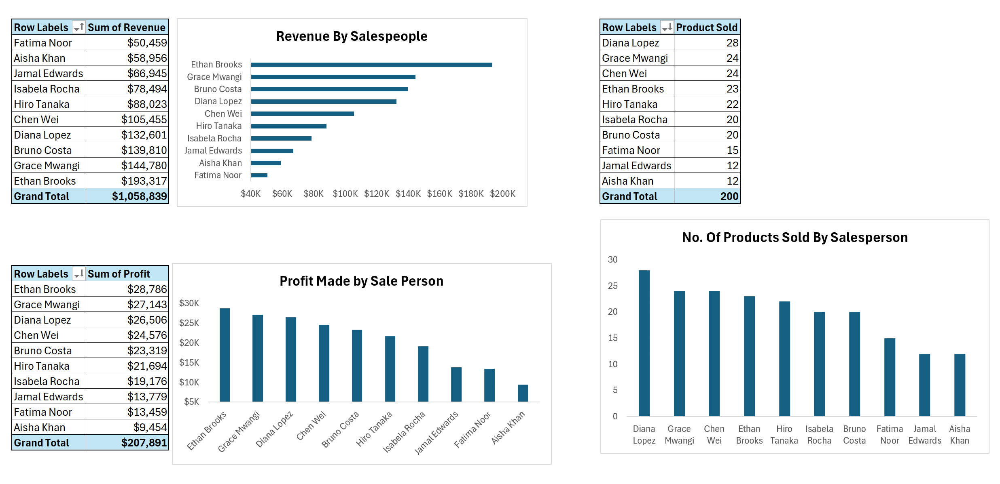
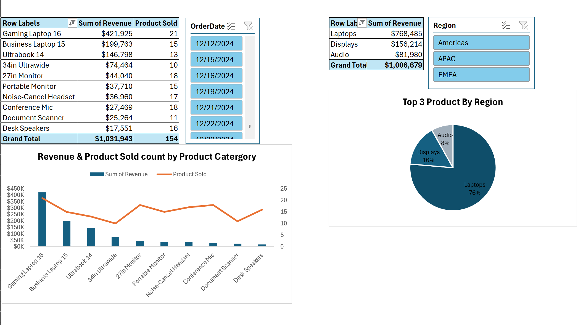
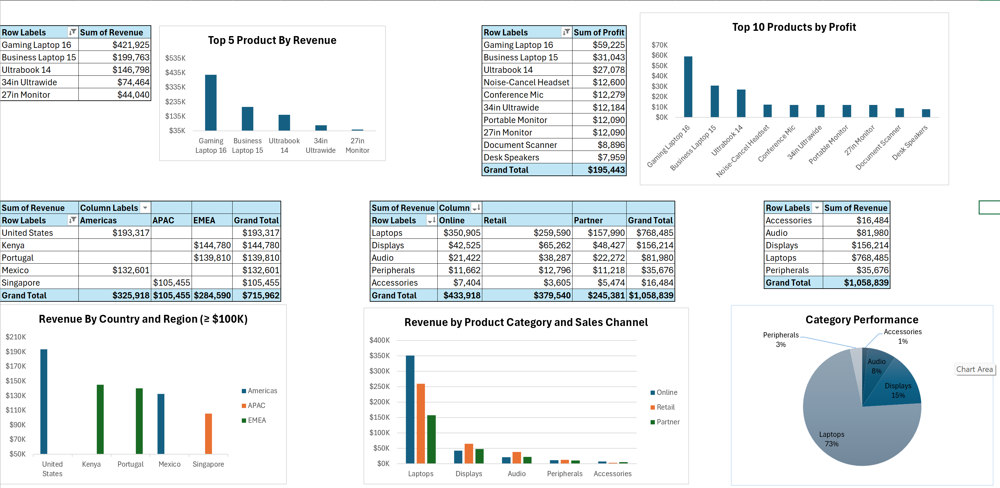

# 📊 Sales Performance Analysis Dashboard — Excel

A comprehensive Excel-based sales analytics project analyzing **$1.05M+ in revenue** across 10 salespeople, multiple product categories, regions, and sales channels. Built with PivotTables, slicers, and dynamic charts to surface actionable business insights.

---

## 📁 Project Overview

This project examines a company's sales dataset to answer key business questions around salesperson performance, product profitability, regional distribution, and channel effectiveness. The analysis was conducted entirely in Microsoft Excel using advanced PivotTables, calculated fields, and interactive visualizations.

---

## 🗂️ Dataset Summary

| Dimension | Details |
|---|---|
| Total Revenue | $1,058,839 |
| Total Profit | $207,891 |
| Total Products Sold | 200 units |
| Salespeople | 10 |
| Product Categories | Laptops, Displays, Audio, Peripherals, Accessories |
| Sales Channels | Online, Retail, Partner |
| Regions | Americas, APAC, EMEA |

---

## 🔍 Key Analyses & Findings

### 1. Salesperson Performance

**Revenue Rankings:**

| Rank | Salesperson | Revenue |
|---|---|---|
| 1 | Ethan Brooks | $193,317 |
| 2 | Grace Mwangi | $144,780 |
| 3 | Bruno Costa | $139,810 |
| 4 | Diana Lopez | $132,601 |
| 10 | Fatima Noor | $50,459 |

**Profit Rankings:**

| Rank | Salesperson | Profit |
|---|---|---|
| 1 | Ethan Brooks | $28,786 |
| 2 | Grace Mwangi | $27,143 |
| 3 | Diana Lopez | $26,506 |

**Units Sold Rankings:**

| Rank | Salesperson | Products Sold |
|---|---|---|
| 1 | Diana Lopez | 28 |
| 2 | Grace Mwangi | 24 |
| 3 | Chen Wei | 24 |

> 💡 **Insight:** Ethan Brooks leads in both revenue and profit, making him the top overall performer. Notably, Diana Lopez ranks 4th in revenue but 1st in units sold — suggesting she focuses on higher-volume, lower-ticket transactions.

---

### 2. Product Performance

**Top 5 Products by Revenue:**

| Product | Revenue |
|---|---|
| Gaming Laptop 16 | $421,925 |
| Business Laptop 15 | $199,763 |
| Ultrabook 14 | $146,798 |
| 34in Ultrawide | $74,464 |
| 27in Monitor | $44,040 |

**Top Products by Profit:**

| Product | Profit |
|---|---|
| Gaming Laptop 16 | $59,225 |
| Business Laptop 15 | $31,043 |
| Ultrabook 14 | $27,078 |

> 💡 **Insight:** The Gaming Laptop 16 alone accounts for ~40% of total revenue and ~30% of total profit, making it the single most critical SKU in the portfolio. Laptops as a category represent 73% of all revenue.

---

### 3. Category Performance

| Category | Revenue | Share |
|---|---|---|
| Laptops | $768,485 | 73% |
| Displays | $156,214 | 15% |
| Audio | $81,980 | 8% |
| Peripherals | $35,676 | 3% |
| Accessories | $16,484 | 1% |

> 💡 **Insight:** The business is heavily concentrated in Laptops. While this drives strong revenue, it also represents a diversification risk. Displays and Audio have growth potential.

---

### 4. Regional & Country Analysis

| Region | Revenue |
|---|---|
| Americas | $325,918 |
| EMEA | $284,590 |
| APAC | $105,455 |

**Top Countries (≥ $100K revenue):**

| Country | Region | Revenue |
|---|---|---|
| United States | Americas | $193,317 |
| Kenya | EMEA | $144,780 |
| Portugal | EMEA | $139,810 |
| Mexico | Americas | $132,601 |
| Singapore | APAC | $105,455 |

> 💡 **Insight:** The Americas leads in revenue, driven primarily by the US and Mexico. APAC lags significantly, with only Singapore exceeding $100K — pointing to an untapped growth opportunity.

---

### 5. Sales Channel Analysis

| Channel | Revenue | Share |
|---|---|---|
| Online | $433,918 | 41% |
| Retail | $379,540 | 36% |
| Partner | $245,381 | 23% |

**Channel breakdown by category (Laptops):**

| Channel | Laptop Revenue |
|---|---|
| Online | $350,905 |
| Retail | $259,590 |
| Partner | $157,990 |

> 💡 **Insight:** Online is the dominant channel across all categories, particularly for high-value Laptops. The Partner channel contributes less but may offer margin efficiency worth exploring further.

---

## 📊 Dashboard Features

- **Interactive PivotTables** for salesperson, product, region, and channel breakdowns
- **Date Slicer** for filtering analysis by specific order dates
- **Region Slicer** for geographic drill-down (Americas, APAC, EMEA)
- **Dynamic Bar & Line Charts** — Revenue & Products Sold by category
- **Pie Charts** — Category share and regional top-product distribution
- **Combo Charts** — Dual-axis revenue + volume analysis

---

## 🛠️ Tools & Techniques

- Microsoft Excel (PivotTables, PivotCharts)
- Slicers & Timeline filters
- Calculated fields for profit margins
- Conditional formatting for ranking highlights
- Custom number formatting ($K notation)
- Multi-sheet dashboard layout

---

## 📌 Business Recommendations

1. **Double down on Ethan Brooks' strategy** — analyze his sales approach and use it to coach lower performers like Aisha Khan and Fatima Noor.
2. **Expand APAC presence** — with only Singapore above $100K, there is significant untapped regional potential.
3. **Reduce product concentration risk** — Gaming Laptop 16 is a single point of failure for revenue. Invest in growing Displays and Audio.
4. **Investigate Diana Lopez's volume approach** — she sells the most units but ranks lower in revenue; pairing her volume capability with higher-ticket products could boost performance.
5. **Optimize Online channel** — already the top channel, a focused digital sales strategy could yield the highest ROI.

---

## 📂 Repository Structure

```
data
├───csv
│   ├───01_original
│   │       01_sales_data_analysis - original-01_products.csv
│   │       01_sales_data_analysis - original-01_sales.csv
│   │       01_sales_data_analysis - original-01_salespeople.csv
│   │
│   ├───02_excel_formula
│   │       02_sales_data_analysis-01_products.csv
│   │       02_sales_data_analysis-01_sales.csv
│   │       02_sales_data_analysis-01_salespeople.csv
│   │
│   ├───03_power_query
│   │       03_sales_data_analysis_power_query-01_products.csv
│   │       03_sales_data_analysis_power_query-01_sales.csv
│   │       03_sales_data_analysis_power_query-01_salespeople.csv
│   │       03_sales_data_analysis_power_query-profit_by_salesperson(chart).csv
│   │       03_sales_data_analysis_power_query-revenue_analysis_slicer.csv
│   │       03_sales_data_analysis_power_query-revenue_by_products(chart).csv
│   │       03_sales_data_analysis_power_query-sales_products_salespeople.csv
│   │
│   └───04_dax
│           04_sales_data_analysis_DAX-01_products.csv
│           04_sales_data_analysis_DAX-01_sales.csv
│           04_sales_data_analysis_DAX-01_salespeople.csv
│           04_sales_data_analysis_DAX-analysis_table_chart.csv
│
├───excel
│       01_sales_data_analysis - original.xlsx
│       02_sales_data_analysis-excelformula.xlsx
│       03_sales_data_analysis_power_query.xlsx
│       04_sales_data_analysis_DAX.xlsx
│
└───image
        profit_by_salesperson.png
        revenue_analysis_based_on_slicer.png
        reveunu_by_product.png
```

---

## 📸 Dashboard Screenshots

### Salesperson Performance Overview


### Revenue Analysis with Slicers


### Revenue & Profit by Product


---

## 👤 Author

**Rajan Shrestha**
- 📧 Email: [stharaz09@gmail.com]

---

*This project is part of my data analytics portfolio showcasing Excel-based business intelligence and dashboard design.*
